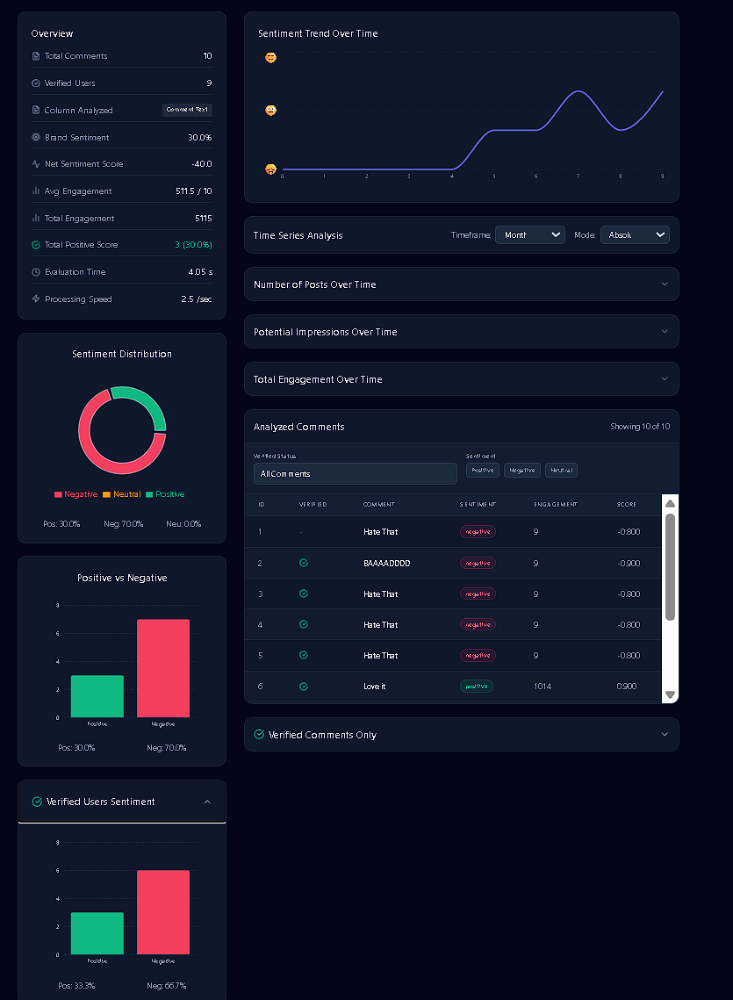
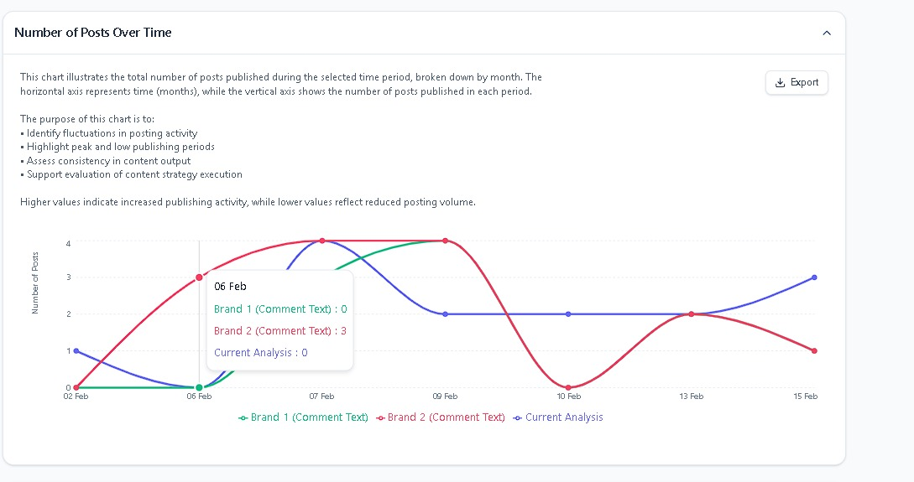
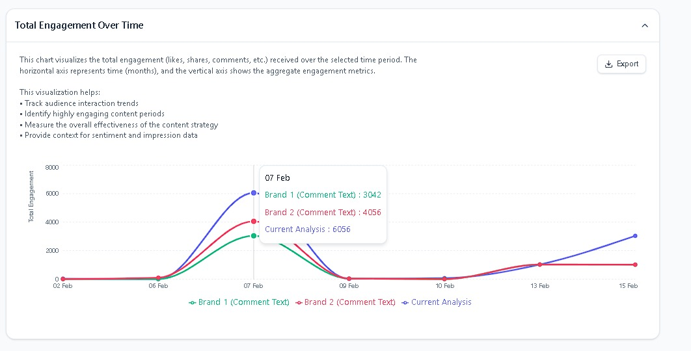
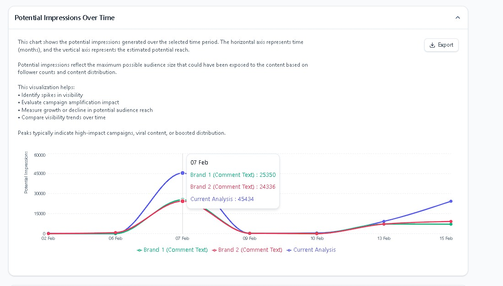

# 🌟 Arabic Sentiment Analyzer

[](https://github.com/yourusername/arabic-sentiment-analysis-dashboard)
[](https://opensource.org/licenses/MIT)

A powerful, React-based web application designed to analyze the sentiment of Arabic text data using the **Google Gemini API**. This tool empowers users to upload datasets, configure analysis parameters, visualize results in real-time, and perform comparative brand analysis with ease.

## 🖼️ Visual Overview

### 📊 Sentiment Analysis Dashboard


*Detailed analysis of comments with sentiment distribution and engagement metrics.*

### 📈 Trends & Performance

|               Posts Over Time               |               Total Engagement               |
| :-----------------------------------------: | :-------------------------------------------: |
|  |  |

### 🚀 Potential Reach


*Insights into potential reach and impressions over time.*

---

## ✨ Key Features

### 📁 Data Ingestion

* **Multi-format Support:** Seamlessly upload `.csv`, `.xlsx`, `.xls`, and `.json` files.
* **Drag-and-Drop:** Intuitive interface for quick file processing.
* **Smart Auto-Detection:** Automatically identifies comment, verified status, and engagement columns.

### 🧠 AI-Powered Analysis

* **Gemini Integration:** Leverages cutting-edge Google Gemini models for accurate Arabic sentiment detection.
* **Real-time Processing:** Visual indicators for current task progress and sentiment results.
* **Configurable Parameters:** Adjustable batch sizes and API delays for optimal rate limit management.

### 📊 Insightful Dashboards

* **Comprehensive Metrics:** Track total comments, brand sentiment percentages, and net scores.
* **Rich Visualizations:** Interactive charts (Pie, Bar, Line) for sentiment trends and distributions.
* **Advanced Filtering:** Drill down into data by sentiment type or user verification status.

### 💾 Data Management

* **Export Options:** Save results as CSV or JSON for external reporting.
* **Project Persistence:** Locally save and revisit projects without re-analyzing.
* **Brand Comparison:** Upload historical data to compare metrics side-by-side.

---

## 🛠️ Setup & Installation

### 1️⃣ Install Dependencies

Ensure you use the legacy peer deps flag for a smooth installation:

```bash
npm install --legacy-peer-deps
```

### 2️⃣ Configure Environment

Create a `.env` file in the root directory and add your API credentials:

```env
VITE_GEMINI_API_KEY=your_api_key_here
```

### 3️⃣ Run Development Server

Start the Vite server and view the app at `http://localhost:3000`:

```bash
npm run dev
```

### 4️⃣ Production Build

Generate a production-ready bundle in the `dist/` folder:

```bash
npm run build
```

---

## 🚀 Technologies Used

* **Core:** React 18, TypeScript, Vite
* **Styling:** Tailwind CSS (Dark/Light Mode)
* **Charts:** Recharts
* **AI:** Google GenAI SDK (Gemini API)
* **Utilities:** PapaParse, XLSX, Lucide React

---

*Developed with ❤️ for Arabic NLP analysis.*
